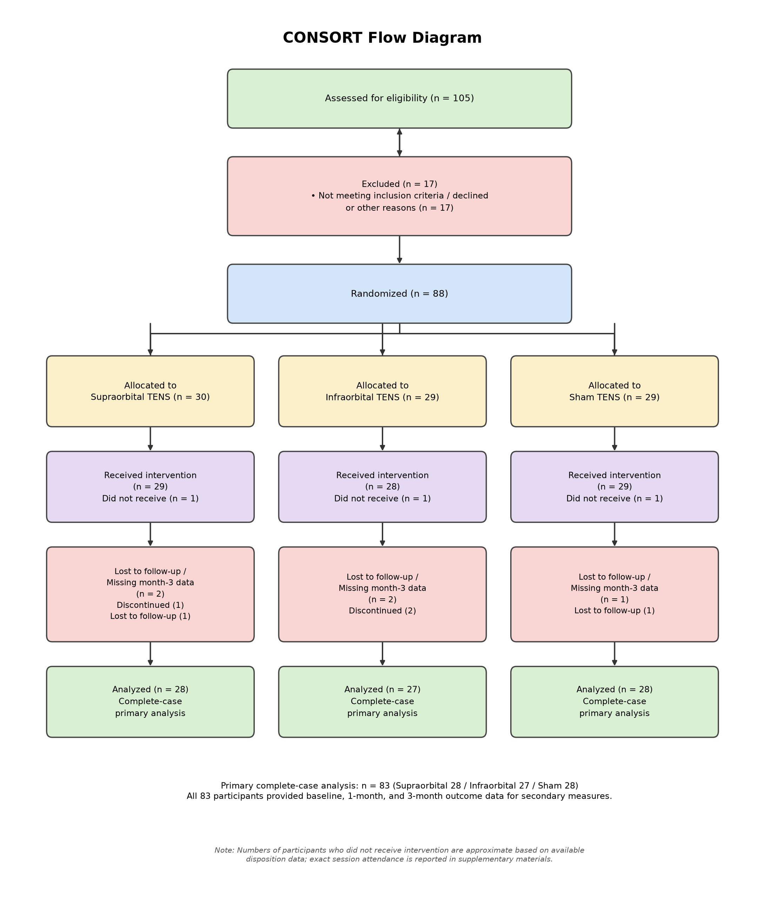
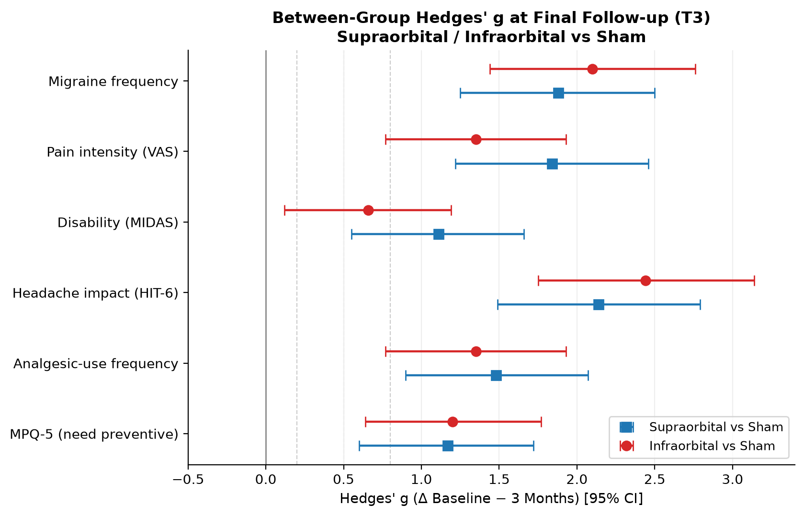

% Comparative Study on the Effect of Transcutaneous Electrical Nerve Stimulation (TENS) of the Supraorbital and Infraorbital Nerves in Improving Clinical Symptoms and Preventing New Attacks in Patients with Migraine
% A Single-Blind, Sham-Controlled Randomized Trial

# Abstract

**Background and Objective:** Migraine is a highly prevalent neurological disorder and a leading cause of disability worldwide. Non-invasive neuromodulation with transcutaneous electrical nerve stimulation (TENS) is a promising preventive option, but direct randomized comparisons of supraorbital versus infraorbital stimulation remain limited. It is unclear whether targeting a different trigeminal branch offers comparable or superior efficacy to the more commonly studied supraorbital site. This trial directly compared the clinical efficacy of TENS applied over these two anatomically distinct sites.

**Methods:** In this single-blind, three-arm randomized controlled trial reported in accordance with CONSORT guidelines, 105 adults with migraine were assessed for eligibility, of whom 17 were excluded prior to randomization. Eighty-eight participants meeting ICHD-3 diagnostic criteria were randomized 1:1:1 to supraorbital TENS (n = 30), infraorbital TENS (n = 29), or sham TENS (n = 29); 83 completed treatment and follow-up and were analyzed. Active stimulation was delivered bilaterally at 100 Hz, intensity titrated to a strong but tolerable sensory level (~10 mA), for 30 minutes per session, six sessions weekly for four weeks. Sham electrodes were placed over the supraorbital nerves without current delivery. The primary outcome was monthly migraine frequency (headache days) at 3 months; secondary outcomes included pain intensity (VAS), disability (MIDAS), headache impact (HIT-6), analgesic-use frequency, and need for preventive medication (MPQ-5).

**Results:** At 3 months, monthly headache days decreased from 14.18 to 6.59 in the supraorbital group (53.5% reduction, p < 0.001) and from 15.13 to 6.16 in the infraorbital group (59.3% reduction, p < 0.001), with no significant change in the sham group (12.32 to 12.94; p = 0.381). Both active groups showed significant improvements across all secondary outcomes and were superior to sham (all p < 0.001). No significant difference was detected between supraorbital and infraorbital stimulation, though the study was not powered for this comparison. Pain intensity decreased by 46.3% and 44.8% in the supraorbital and infraorbital groups, respectively, versus 7.1% with sham. No serious adverse events occurred.

**Conclusion:** Supraorbital and infraorbital TENS are effective non-invasive adjuncts for improving migraine-related outcomes compared with sham stimulation. However, owing to methodological limitations — including underpowering for the between-site comparison, sham-site asymmetry, and incomplete blinding — these findings should be considered preliminary and hypothesis-generating rather than confirmatory. Larger, site-matched, rigorously blinded trials are warranted.

**Keywords:** Migraine; Transcutaneous electrical nerve stimulation; Supraorbital nerve; Infraorbital nerve; Trigeminal neuromodulation; Randomized controlled trial

**Trial registration:** Ethics approval code []; IRCT registration number [].

# 1. Introduction

Migraine is a prevalent and disabling neurological disorder, ranked as the second leading cause of disability worldwide by the Global Burden of Disease Study (2016), a finding subsequently reaffirmed by the GBD2019 update [1,2]. It is characterized by recurrent unilateral headaches of moderate to severe intensity, typically accompanied by photophobia, phonophobia, nausea, and vomiting, lasting 4–72 hours [3]. Current evidence suggests that migraine represents a primary episodic brain disorder involving activation and sensitization of the trigeminovascular pathway, alongside impaired structural and functional connectivity between cranio-cervical afferents, the brainstem, and higher cortical and subcortical networks [4].

Migraine affects over 20% of the global population at some point in life, with a substantial proportion seeking medical care: headache accounts for 4.4% of general practice visits [5], approximately 5% of hospital consultations [6], and about 20% of neurology outpatient visits [7]. Epidemiological studies indicate that 4.5% of the Western European population experiences headaches on at least 15 days per month [8], and approximately 1% suffer from chronic migraine [9], placing a significant socioeconomic burden on healthcare systems [10].

Treatment strategies focus on both prophylaxis and acute attack management. Although pharmacological agents are widely used, their benefits are often offset by adverse effects and the risk of medication overuse headache [11]. This has driven growing interest in non-pharmacological therapies, which offer improved tolerability and safety profiles.

Neuromodulation targeting peripheral nerves has emerged as a promising approach to modulate nociceptive signaling and potentially reduce migraine burden [12,13,27]. Transcutaneous electrical nerve stimulation (TENS), delivering low-voltage pulsed currents across intact skin, is a non-invasive modality designed to stimulate peripheral nerves for pain control [14]. Its analgesic potential, supported by the gate control theory, has prompted investigations into its utility for migraine [15].

The Cefaly® device, the first FDA-cleared medical device for migraine prophylaxis, applies transcutaneous stimulation to the supraorbital and supratrochlear nerves [15,16]. Clinical studies have shown that supraorbital nerve stimulation via TENS (tSNS) can reduce migraine frequency, headache days, and analgesic use, with minimal side effects [16–22]. A recent non-inferiority randomized trial comparing tSNS with low-dose (25 mg) topiramate found that tSNS failed to demonstrate non-inferiority, showing a significantly lower 50% responder rate than topiramate (20.6% vs. 33.9%) [23]; however, tSNS demonstrated a markedly more favorable safety profile (adverse event rate 4.3% vs. 22.4%), suggesting it may still be a reasonable option for medication-intolerant patients rather than an equally effective first-line alternative. Comparative studies of neurostimulation parameters, such as frequency, suggest that stimulation settings can influence headache burden [24], raising the question of whether the anatomical site of stimulation may similarly affect clinical outcomes.

In contrast, evidence for infraorbital nerve stimulation remains limited and derives mainly from invasive approaches. Available studies involving nerve blocks or implanted stimulators report reductions in attack frequency, pain intensity, and disability scores [25,26]; however, non-invasive transcutaneous stimulation of the infraorbital nerve has not, to our knowledge, been directly compared with the more established supraorbital site in a randomized setting.

Given the demonstrated efficacy and safety of neuromodulation and its potential to target multiple trigeminal nerve branches, a head-to-head comparison of supraorbital and infraorbital nerve stimulation is warranted. This randomized sham-controlled trial aimed to evaluate and compare the effects of TENS applied to the supraorbital and infraorbital nerves on monthly headache days (primary outcome), pain intensity, disability, headache impact, and medication-related outcomes (secondary outcomes).

# 2. Materials and Methods

## 2.1. Study Design

A single-blind, three-arm randomized controlled trial was conducted between 2020 and 2021 at the outpatient Physical Medicine and Rehabilitation clinics of Isfahan University of Medical Sciences, Iran. The study is reported in accordance with the CONSORT 2010 statement and the CONSORT extension for non-pharmacological treatments. The study protocol was approved by the institutional ethics committee and prospectively registered in the national clinical trial registry (IRCT). Written informed consent was obtained from all participants, and the study adhered to the principles of the Declaration of Helsinki.

## 2.2. Participants

Eligible participants were adults aged 18–65 years with a confirmed diagnosis of migraine with or without aura according to the International Classification of Headache Disorders, 3rd edition (ICHD-3) criteria (codes 1.1, 1.2.1) [3], and a history of ≥2 migraine attacks per month over the preceding three months. Monthly migraine (headache) frequency was ascertained from a prospective headache diary completed daily throughout the study period. Written informed consent was obtained from all participants.

A total of 105 patients with migraine, all of whom met the clinical and diagnostic inclusion criteria described above, were initially assessed for eligibility. Of these, 17 were excluded prior to randomization (not meeting inclusion criteria, declining participation, or other logistical reasons). The remaining 88 patients were randomized 1:1:1 to the supraorbital (n = 30), infraorbital (n = 29), and sham (n = 29) groups. One participant in each arm was allocated but did not receive the intervention (n = 29, 28, and 29 who actually received treatment, respectively). Of those who received treatment, 2 participants in the supraorbital group (1 discontinued, 1 lost to follow-up), 2 in the infraorbital group (2 discontinued), and 1 in the sham group (lost to follow-up) did not provide complete 3-month outcome data. The primary complete-case analysis therefore included 83 participants (supraorbital n = 28, infraorbital n = 27, sham n = 28); all 83 analyzed participants provided baseline, 1-month, and 3-month data for the secondary outcome measures. The full participant flow is detailed in the CONSORT flow diagram (Figure 1).

## 2.3. Sample Size Calculation

Sample size was determined assuming a 95% confidence level (Z₁ = 1.96) and 80% statistical power (Z₂ = 0.84), using expected response rates of 38% in the active intervention groups and 12% in the sham group, based on prior supraorbital transcutaneous stimulation data [16]. Using the standard two-proportion sample-size formula:

n = [(Z₁+Z₂)² × (S₁² + S₂²)] / (m₁−m₂)²

with Z₁ = 1.96, Z₂ = 0.84, S₁ = 0.12, and S₂ = 0.38, the minimum requirement was 22 participants per group. Allowing for 20% attrition, 27 participants per group were planned (target total = 81). To further guard against dropout, 88 participants were ultimately randomized (30 to supraorbital, 29 to infraorbital, and 29 to sham); 83 were ultimately analyzed in the primary complete-case analysis.

## 2.4. Randomization and Blinding

Participants were allocated in a 1:1:1 ratio to the three study arms using computer-generated random sequences. Allocation procedures were matched across arms with respect to electrode placement and session schedule. Outcome assessment was performed by an investigator blinded to group assignment; however, the treating therapist delivering the intervention was necessarily unblinded (i.e., aware of each participant's allocated arm), since electrode placement itself differs visibly between the supraorbital and infraorbital sites.

As this was a single-blind trial, participants — not the treating therapist or, ideally, the outcome assessor — were intended to remain unaware of their allocated intervention throughout the study. Participants in different study arms had no contact with one another during the treatment period, minimizing the risk of unblinding through cross-group comparison of treatment experience. For the sham arm, the device's "on" indicator light was illuminated during each session without delivery of electrical current, simulating the sensory experience of receiving active treatment. Session duration, frequency, and scheduling were standardized across all three arms, and sham electrode placement was matched to that of the supraorbital active-treatment arm. Because sham delivered no current, complete sensory blinding of participants cannot be assumed; because the sham condition did not replicate the infraorbital electrode placement, the infraorbital-versus-sham contrast is also not perfectly site-matched. Both issues are discussed as limitations in Section 4.8.

## 2.5. Exclusion Criteria

Exclusion criteria comprised: use of prophylactic migraine medication within two weeks prior to enrollment; receipt of preventive interventions (e.g., nerve block, botulinum toxin) within the past year; medication-overuse headache (ICHD-3 code 8.2); concurrent headache disorders; severe psychiatric or systemic illness; pregnancy or lactation; substance abuse; and treatment non-compliance.

## 2.6. Outcome Measures

Outcomes were assessed at baseline, 1 month, and 3 months after the start of the intervention.

**Primary efficacy outcome:** Monthly migraine frequency (headache days) at 3 months, ascertained from a prospective headache diary (Section 2.2).

**Secondary outcomes:**

- Pain intensity on a 0–10 visual analog scale (VAS)
- Migraine-related disability using the Migraine Disability Assessment (MIDAS) [28]
- Headache impact using the Headache Impact Test (HIT-6) [29,30]
- Frequency of oral analgesic medication use (number of occasions of acute oral analgesic intake per month)
- Need for preventive medication assessed with the Migraine Prevention Questionnaire (MPQ-5) [31]

## 2.7. Interventions

Participants were randomly assigned to one of three intervention groups. Participants in each group were kept blinded to the interventions received by the other two groups.

**Supraorbital TENS (Group 1):** Bilateral transcutaneous electrical nerve stimulation (TENS) was applied over the supraorbital nerves using surface electrodes in the outpatient clinic, under therapist supervision, with a two-channel clinical electrotherapy stimulator. Stimulation was delivered at a frequency of 100 Hz for 30 minutes per session. Current intensity was individually and gradually increased by the therapist up to the maximum level tolerated by the participant that produced a strong but comfortable paresthesia (approximately 10 mA). Treatment was scheduled as six sessions per week for four consecutive weeks (24 sessions total).

**Infraorbital TENS (Group 2):** Participants received bilateral TENS over the infraorbital foramina, using the same device, stimulation parameters, treatment schedule, and intensity-titration protocol as Group 1.

**Sham TENS (Group 3):** Surface electrodes were placed bilaterally over the supraorbital nerves, following the same treatment schedule and session duration as Group 1. The channel output was disabled so that no electrical current was delivered to the electrodes throughout the session; however, the device's indicator light remained illuminated for the full 30 minutes, giving participants the impression that the device was active, thereby providing an inert sham intervention.

Throughout the study, all participants continued standard acute migraine therapy as clinically indicated. Treatment adherence was assessed by attendance at scheduled outpatient sessions. Of the 88 randomized participants, 83 provided complete baseline, 1-month, and 3-month outcome data and were included in the primary complete-case analysis; the remaining 5 participants did not complete the full protocol, as detailed in the CONSORT flow diagram (Figure 1) and addressed via the sensitivity analyses described in Section 2.8.

*Limitation: Although the sham device's indicator light remained illuminated throughout each session to simulate active treatment, the complete absence of paresthesia in the sham group—in contrast to the strong but comfortable paresthesia experienced by participants in the two active TENS groups—may have compromised participant blinding (Section 4.8).*

## 2.8. Statistical Analysis

All statistical analyses were conducted using SPSS software (version 20; IBM Corp., Armonk, NY, USA). Continuous variables are presented as mean ± standard deviation (SD). Baseline comparisons among the three groups were performed using one-way analysis of variance (ANOVA) for continuous variables and Pearson's chi-square test (or Fisher's exact test when expected frequencies were low) for categorical variables. Longitudinal within-group changes across baseline, 1 month, and 3 months were evaluated using repeated-measures ANOVA, with Greenhouse–Geisser correction applied when sphericity assumptions were violated. Between-group differences at follow-up were assessed using one-way ANOVA with post-hoc pairwise comparisons. Where relevant, analysis of covariance (ANCOVA) was used to adjust for baseline values. A two-sided p-value < 0.05 was considered statistically significant.

To facilitate interpretation of treatment-effect magnitude beyond hypothesis testing, standardized effect sizes (Hedges' g, which applies a small-sample correction to Cohen's d) were additionally computed both within each group (baseline → 1 month) and between groups (Δ baseline−1 month; Δ baseline−3 months), with 95% confidence intervals; random-effects pooled within-group estimates across the three arms are also reported for the within-group analysis. These effect-size analyses are presented in Section 3.4 (Tables 8–10) and interpreted further in the Discussion.

**Sensitivity analysis:** To assess the robustness of the primary findings against potential attrition bias, a sensitivity analysis was conducted for the primary outcome (migraine frequency at 3 months) under two worst-case imputation scenarios for the 5 randomized participants who did not provide complete 3-month data. In Scenario A, these 5 participants were assumed to have zero improvement (change from baseline = 0) and were added to the sham group to artificially dilute the treatment effect. In Scenario B, a more pessimistic assumption was applied: these participants were assumed to have deteriorated by 2 migraine days per month and were added to the sham group. Additionally, to rule out that extreme baseline values drove the effect, the primary analysis was re-run after excluding participants with a baseline migraine frequency > 20 per month. Both scenarios preserved the significance of the between-group differences (p < 0.001 for both active groups versus sham).

# 3. Results

## 3.1. Baseline Characteristics

Eighty-three patients with migraine were included in the primary complete-case analysis: supraorbital TENS (n = 28), infraorbital TENS (n = 27), and sham control (n = 28). Baseline age and sex distribution were similar across groups (p = 0.72 and p = 0.94, respectively), indicating demographic homogeneity (Table 1). Overall, 63 of 83 participants (75.9%) were female.

**Table 1.** Baseline demographic characteristics of participants across study groups. Values are mean ± SD or n. No significant between-group differences were found.

| Characteristic | Group 1 – Supraorbital (n = 28) | Group 2 – Infraorbital (n = 27) | Group 3 – Sham (n = 28) | Test | p-value |
|---|---|---|---|---|---|
| Mean age, years | 35.8 ± 7.6 | 36.4 ± 6.9 | 35.1 ± 7.2 | One-way ANOVA | 0.72 |
| Sex (Female/Male) | 21 / 7 | 20 / 7 | 22 / 6 | Chi-square | 0.94 |

## 3.2. Clinical Outcomes Over Time

### 3.2.1. Monthly Migraine Frequency (Headache Days)

For the primary outcome, both active TENS groups demonstrated significant reductions in migraine frequency compared with baseline (supraorbital: 14.18 ± 3.95 to 6.59 ± 2.70; infraorbital: 15.13 ± 4.51 to 6.16 ± 2.48; p < 0.001 for both), whereas the sham group showed no significant change (12.32 ± 4.99 to 12.94 ± 5.01; p = 0.381) (Table 2).

**Table 2.** Changes in monthly migraine frequency (headache days; primary outcome) over the study period. Data are mean ± SD.

| Group | Baseline | 1 Month | 3 Months | p-value |
|---|---|---|---|---|
| Supraorbital (Group 1) | 14.18 ± 3.95 | 7.68 ± 2.84 | 6.59 ± 2.70 | < 0.001 |
| Infraorbital (Group 2) | 15.13 ± 4.51 | 9.19 ± 4.03 | 6.16 ± 2.48 | < 0.001 |
| Sham (Group 3) | 12.32 ± 4.99 | 14.27 ± 4.15 | 12.94 ± 5.01 | 0.381 |

### 3.2.2. Pain Intensity (VAS)

Pain severity decreased significantly in the supraorbital (7.30 ± 1.29 to 3.92 ± 0.97) and infraorbital (7.07 ± 1.47 to 3.90 ± 1.33) groups (p < 0.001 for both), with no significant reduction in the sham group (7.0 ± 1.2 to 6.5 ± 1.2; p = 0.08) (Table 3).

**Table 3.** Pain intensity (VAS) scores at baseline, 1 month, and 3 months. Data are mean ± SD.

| Group | Baseline | 1 Month | 3 Months | p-value |
|---|---|---|---|---|
| Supraorbital (Group 1) | 7.30 ± 1.29 | 4.07 ± 0.76 | 3.92 ± 0.97 | < 0.001 |
| Infraorbital (Group 2) | 7.07 ± 1.47 | 5.05 ± 1.24 | 3.90 ± 1.33 | < 0.001 |
| Sham (Group 3) | 7.0 ± 1.2 | 6.8 ± 1.3 | 6.5 ± 1.2 | 0.08 |

### 3.2.3. Disability (MIDAS)

MIDAS scores improved significantly in both active groups (supraorbital: 20.02 ± 5.22 to 9.76 ± 3.12; infraorbital: 17.94 ± 6.30 to 11.71 ± 3.09; p < 0.001 for both), but not in the sham group (18.2 ± 5.1 to 17.1 ± 4.7; p = 0.14) (Table 4).

**Table 4.** MIDAS disability scores at baseline, 1 month, and 3 months. Data are mean ± SD.

| Group | Baseline | 1 Month | 3 Months | p-value |
|---|---|---|---|---|
| Supraorbital (Group 1) | 20.02 ± 5.22 | 12.33 ± 3.94 | 9.76 ± 3.12 | < 0.001 |
| Infraorbital (Group 2) | 17.94 ± 6.30 | 13.19 ± 4.62 | 11.71 ± 3.09 | < 0.001 |
| Sham (Group 3) | 18.2 ± 5.1 | 17.6 ± 5.0 | 17.1 ± 4.7 | 0.14 |

### 3.2.4. Headache Impact (HIT-6)

Significant decreases in HIT-6 scores were observed in the supraorbital (62.58 ± 4.78 to 49.48 ± 4.84) and infraorbital (64.22 ± 5.93 to 51.40 ± 3.01) groups (p < 0.001 for both), with no significant change in the sham group (63.0 ± 6.0 to 61.2 ± 5.4; p = 0.16) (Table 5). Mean HIT-6 scores moved from the severe-impact range (≥ 60) to little or no impact in the supraorbital group and to some impact in the infraorbital group [29].

**Table 5.** HIT-6 scores at baseline, 1 month, and 3 months. Data are mean ± SD.

| Group | Baseline | 1 Month | 3 Months | p-value |
|---|---|---|---|---|
| Supraorbital (Group 1) | 62.58 ± 4.78 | 51.50 ± 3.61 | 49.48 ± 4.84 | < 0.001 |
| Infraorbital (Group 2) | 64.22 ± 5.93 | 51.50 ± 5.39 | 51.40 ± 3.01 | < 0.001 |
| Sham (Group 3) | 63.0 ± 6.0 | 61.9 ± 5.7 | 61.2 ± 5.4 | 0.16 |

### 3.2.5. Medication Usage

Both active TENS groups exhibited significant reductions in oral analgesic consumption (supraorbital: 14.17 ± 3.89 to 5.02 ± 2.64; infraorbital: 14.72 ± 3.50 to 5.65 ± 2.55; p < 0.001 for both). Analgesic use also decreased significantly in the sham group (15.24 ± 4.77 to 12.06 ± 4.25; p < 0.001), although absolute values remained higher than in the active arms at 3 months; this sham-group reduction is interpreted further in Section 4.2. The need for preventive medication, assessed using the MPQ-5, decreased significantly in both active groups (supraorbital: 24.43 ± 6.50 to 16.77 ± 5.08; infraorbital: 26.27 ± 6.21 to 15.04 ± 5.28; p < 0.001 for both), with no significant change in the sham group (25.42 ± 6.40 to 24.16 ± 4.23; p = 0.507) (Table 6).

**Table 6.** Medication-related outcomes before and after intervention. Need for preventive medication was assessed using the MPQ-5. Data are mean ± SD.

| Outcome | Group | Baseline | 1 Month | 3 Months | p-value |
|---|---|---|---|---|---|
| Frequency of oral analgesic use (occasions/month) | Supraorbital | 14.17 ± 3.89 | 6.21 ± 2.59 | 5.02 ± 2.64 | < 0.001 |
| | Infraorbital | 14.72 ± 3.50 | 8.24 ± 3.18 | 5.65 ± 2.55 | < 0.001 |
| | Sham | 15.24 ± 4.77 | 12.72 ± 2.88 | 12.06 ± 4.25 | < 0.001 |
| MPQ-5 (need for preventive medication) | Supraorbital | 24.43 ± 6.50 | 16.73 ± 5.74 | 16.77 ± 5.08 | < 0.001 |
| | Infraorbital | 26.27 ± 6.21 | 16.30 ± 4.65 | 15.04 ± 5.28 | < 0.001 |
| | Sham | 25.42 ± 6.40 | 24.17 ± 6.49 | 24.16 ± 4.23 | 0.507 |

## 3.3. Between-Group Comparisons at Three Months

One-way analysis of variance revealed significant differences among the three groups across all six clinical outcomes at 3 months (all p < 0.001). Post-hoc pairwise comparisons indicated that both active TENS groups were significantly superior to sham across all outcomes, with no statistically significant differences between supraorbital and infraorbital stimulation, although supraorbital stimulation showed numerically greater improvement on some measures (Table 7).

**Table 7.** Between-group comparisons of clinical outcomes at 3 months (one-way ANOVA with post-hoc pairwise comparisons; Supraorbital n = 28, Infraorbital n = 27, Sham n = 28).

| Outcome | p-value | Post-hoc interpretation |
|---|---|---|
| Migraine frequency | < 0.001 | Sham > Supraorbital = Infraorbital |
| Pain intensity (VAS) | < 0.001 | Sham > Supraorbital = Infraorbital |
| Disability (MIDAS) | < 0.001 | Sham > Supraorbital = Infraorbital |
| Headache impact (HIT-6) | < 0.001 | Sham > Supraorbital = Infraorbital |
| Oral analgesic-use frequency | < 0.001 | Sham > Supraorbital = Infraorbital |
| MPQ-5 (preventive need) | < 0.001 | Sham > Supraorbital = Infraorbital |

## 3.4. Standardized Effect Sizes (Hedges' g)

To facilitate interpretation of treatment-effect magnitude beyond hypothesis testing, standardized effect sizes (Hedges' g, which applies a small-sample correction to Cohen's d) were additionally computed both within each group (baseline → 1 month) and between groups (Δ baseline−1 month; Δ baseline−3 months), with 95% confidence intervals; random-effects pooled within-group estimates across the three arms are also reported for the within-group analysis. For the five outcomes assessed by patient-reported instruments (VAS, MIDAS, HIT-6, analgesic-use frequency, MPQ-5), effect sizes were computed directly from reported paired summary statistics. For migraine frequency (the primary outcome), individual-level paired data were not available, so within- and between-group change-score effect sizes were estimated from the group-level means and SDs at each timepoint (Table 2) assuming a baseline–follow-up correlation of r = 0.5 (a standard neutral assumption used when raw paired correlations are unavailable [44,45]); these estimates should therefore be interpreted as approximate.

Within-group Hedges' g values for the baseline-to-1-month interval showed consistently large effects for supraorbital TENS across all clinical outcomes (g = 1.54–2.96), moderate-to-large effects for infraorbital TENS (g = 0.84–2.18), and negligible-to-small effects for sham across most outcomes, with the exception of a medium effect for VAS (g = 0.71) (Table 8). Random-effects pooled estimates likewise indicated large overall treatment effects for pain intensity, headache impact, analgesic use, and preventive medication need.

**Table 8.** Within-group Hedges' g (Baseline → 1 Month).

| Outcome | Group 1 g [95% CI] | Group 2 g [95% CI] | Group 3 g [95% CI] | Pooled (RE) g [95% CI] |
|---|---|---|---|---|
| Migraine frequency | 1.79 [1.20, 2.38] | 1.34 [0.83, 1.86] | −0.41 [−0.79, −0.03] | 0.90 [−0.53, 2.32] |
| MPQ5 | 1.84 [1.18, 2.49] | 1.35 [0.77, 1.93] | −0.41 [−0.95, 0.13] | 0.92 [−0.46, 2.29] |
| VAS | 2.96 [1.98, 3.94] | 1.43 [0.82, 2.04] | 0.71 [0.23, 1.19] | 1.62 [0.52, 2.73] |
| MIDAS | 1.61 [0.96, 2.27] | 0.84 [0.33, 1.34] | 0.31 [−0.25, 0.87] | 0.90 [0.21, 1.59] |
| HIT-6 | 2.54 [1.69, 3.40] | 2.18 [1.40, 2.96] | −0.31 [−0.76, 0.13] | 1.45 [−0.55, 3.44] |
| Freq. Preventive | 2.29 [1.55, 3.02] | 1.71 [1.04, 2.39] | 0.44 [−0.13, 1.01] | 1.46 [0.35, 2.57] |
| Need Preventive | 1.54 [0.96, 2.12] | 1.86 [1.14, 2.59] | 0.19 [−0.34, 0.72] | 1.18 [0.14, 2.22] |

At the 1-month interim assessment, between-group effect sizes already demonstrated large superiority of both active interventions over sham, particularly for headache impact (HIT-6), pain intensity (VAS), and migraine frequency; effect sizes comparing supraorbital and infraorbital stimulation remained mostly trivial to small at this timepoint, aside from a medium effect for VAS (g = 0.69) (Table 9).

**Table 9.** Between-group Hedges' g (Δ Baseline − 1 Month).

| Outcome | Group1 vs Group3 g [95% CI] | Group2 vs Group3 g [95% CI] | Group1 vs Group2 g [95% CI] |
|---|---|---|---|
| Migraine frequency | 2.02 [1.38, 2.67] | 1.74 [1.12, 2.36] | 0.14 [−0.38, 0.66] |
| MPQ5 | 1.47 [0.89, 2.06] | 1.27 [0.70, 1.85] | 0.11 [−0.41, 0.64] |
| VAS | 1.35 [0.78, 1.93] | 0.63 [0.10, 1.17] | 0.69 [0.15, 1.22] |
| MIDAS | 0.89 [0.35, 1.44] | 0.46 [−0.07, 0.98] | 0.43 [−0.10, 0.96] |
| HIT-6 | 2.18 [1.52, 2.83] | 2.09 [1.44, 2.74] | −0.23 [−0.75, 0.30] |
| Freq. Preventive | 1.33 [0.76, 1.90] | 0.85 [0.31, 1.40] | 0.51 [−0.03, 1.03] |
| Need Preventive | 0.99 [0.44, 1.54] | 1.04 [0.48, 1.60] | −0.11 [−0.63, 0.41] |

At the 3-month (final) follow-up, effect-size estimates confirmed the durability of treatment benefits: both active stimulation protocols showed consistently large between-group effects compared with sham across nearly all clinical outcomes (Hedges' g generally > 1.0, with one medium-sized exception for MIDAS in the infraorbital-vs-sham contrast, g = 0.66), whereas direct comparisons between supraorbital and infraorbital stimulation yielded trivial-to-small effect sizes with confidence intervals crossing zero (Table 10), reinforcing the Table 7 finding that neither stimulation site demonstrated statistically or clinically significant superiority over the other.

**Table 10.** Between-group Hedges' g (Δ Baseline − 3 Months). Negative values favor the first-named group (lower scores = improvement).

| Outcome | Group1 vs Group3 g [95% CI] | Group2 vs Group3 g [95% CI] | Group1 vs Group2 g [95% CI] |
|---|---|---|---|
| Migraine frequency | 1.88 [1.25, 2.50] | 2.10 [1.44, 2.76] | −0.37 [−0.89, 0.16] |
| MPQ5 | 1.52 [0.93, 2.10] | 1.75 [1.14, 2.37] | −0.26 [−0.79, 0.26] |
| VAS | 1.84 [1.22, 2.46] | 1.35 [0.77, 1.93] | 0.11 [−0.41, 0.63] |
| MIDAS | 1.11 [0.55, 1.66] | 0.66 [0.12, 1.19] | 0.43 [−0.10, 0.96] |
| HIT-6 | 2.14 [1.49, 2.79] | 2.44 [1.75, 3.14] | 0.04 [−0.48, 0.56] |
| Freq. Preventive | 1.48 [0.90, 2.07] | 1.35 [0.77, 1.93] | 0.15 [−0.37, 0.67] |
| Need Preventive | 1.17 [0.60, 1.72] | 1.20 [0.64, 1.77] | −0.28 [−0.80, 0.25] |

*Note: |g| ≈ 0.2 small, 0.5 medium, 0.8 large, ≥ 1.2 very large.*

## 3.5. Adverse Events and Tolerability

In both active intervention groups, the most commonly reported adverse effects were mild, expected stimulation-related sensations at the electrode site, assessed by open-ended clinician inquiry at each treatment session. These categories were not mutually exclusive, as participants could report more than one sensation. Itching at the electrode site was reported by 9/28 (32.1%) participants in the supraorbital group, 8/27 (29.6%) in the infraorbital group, and 3/28 (10.7%) in the sham group; paresthesia/tingling was reported by 12/28 (42.9%) and 11/27 (40.7%) in the supraorbital and infraorbital groups, respectively, but by no participants in the sham group (0/28), consistent with the absence of delivered current in this arm. The lower but non-zero rate of itching in the sham group likely reflects a non-specific skin reaction to the electrode adhesive/gel, common to all three groups, whereas the higher rates in the active groups may additionally reflect a stimulation-related component. All reported sensations in the active groups were transient, did not require treatment discontinuation, and were consistent with the known tolerability profile of TENS, which is generally well tolerated with mild, self-limiting skin-related adverse effects and no serious adverse events reported in large-scale reviews [32]. No serious adverse events were reported in any group. None of the 5 participants who did not provide complete 3-month outcome data (Section 2.2, Figure 1) discontinued due to an adverse event. The open-ended capture method is acknowledged as a limitation (Section 4.8), as milder or non-obvious effects may have been under-reported; the complete absence of paresthesia in the sham group, despite a low background rate of itching, is also discussed in relation to blinding integrity (Section 4.8).

# 4. Discussion

## 4.1. Overview of Main Findings

The present randomized sham-controlled trial was designed to compare the therapeutic effects of TENS applied over two major sensory branches of the trigeminal nerve — the supraorbital and infraorbital nerves — in patients with migraine. Both stimulation protocols resulted in significant improvements in migraine frequency (the primary outcome), pain intensity, migraine-related disability, headache impact, oral analgesic consumption, and need for preventive medication as assessed by MPQ-5. At 3 months, both interventions produced comparable clinical benefits, with no statistically significant superiority between stimulation sites; because the trial was neither powered nor pre-specified for equivalence or non-inferiority testing, this finding should be read as inconclusive for the site comparison rather than as proof of equivalence, and should be weighed alongside the site-mismatched sham design described in Section 2.4.

Beyond statistical significance, the magnitude of improvement appears clinically meaningful. Reductions of approximately 45–50% in pain intensity, together with substantial improvements in MIDAS and HIT-6 scores, suggest that the observed benefits are likely to translate into tangible improvements in daily functioning and quality of life. Within-group Hedges' g values calculated for the baseline-to-1-month interval reinforce this impression: supraorbital TENS showed consistently large effects across all clinical outcomes (g = 1.54–2.96), whereas infraorbital TENS showed moderate-to-large effects (g = 0.84–2.18), while sham stimulation produced negligible or small effects across most outcomes (Table 8, Section 3.4). However, interpretation of the active-versus-sham contrasts must account for the fact that (a) all outcomes were patient-reported, and (b) complete sensory blinding of the sham arm cannot be assumed, since no current was delivered in that condition (Section 2.4); this raises the possibility that expectation effects contributed to some portion of the observed effect sizes, alongside a genuine physiological effect.

## 4.2. Comparison with Existing Literature

Our results align with the growing body of evidence supporting neuromodulation as a non-pharmacological intervention for migraine. The TEAM study (enrollment 2018–2019), the largest multicenter randomized trial evaluating external trigeminal nerve stimulation (eTNS) for acute migraine treatment, reported 2-hour pain freedom of 25.5% with active stimulation versus 18.3% with sham (p = 0.043), and freedom from the most bothersome symptom of 56.4% versus 42.3% (p = 0.001) [33]. Although TEAM assessed acute rather than preventive outcomes, it supports the broader clinical relevance of trigeminal neuromodulation. A systematic review and meta-analysis of neuromodulation RCTs similarly found that selected techniques, including supraorbital TENS for prevention, can improve migraine-related outcomes with a generally favorable safety profile; however, overall evidence quality remains limited and effect sizes are typically small to moderate [34].

Our findings are consistent with this literature. We observed a 46.3% reduction in pain intensity (VAS) in the supraorbital group and 44.8% in the infraorbital group at 3 months, compared with only 7.1% in the sham group (p < 0.001). These results are directionally comparable to those of Jiang et al., who reported a ≥50% responder rate of 39.22% with transcutaneous supraorbital neurostimulation alone, similar to flunarizine monotherapy (46.15%; p = 0.90) [35]. Effect-size analysis further contextualizes these findings: between-group Hedges' g at the 1-month interim assessment already demonstrated large superiority of both active interventions over sham, particularly for headache impact (HIT-6), pain intensity (VAS), and migraine frequency, whereas effect sizes comparing supraorbital and infraorbital stimulation remained trivial to small for most outcomes at both 1 and 3 months (Tables 9–10, Section 3.4), supporting the absence of clinically meaningful differences between the two active stimulation sites.

**Medication reduction.** Oral analgesic frequency decreased by 64.6% with supraorbital and 61.6% with infraorbital stimulation; MPQ-5 preventive-need scores decreased by 31.4% and 42.8%, respectively. These findings are clinically relevant because migraine remains a leading cause of disability and pharmacological management is often limited by adverse effects, medication-overuse headache, and poor adherence [11,39]. Evidence from other non-invasive neuromodulation approaches, including non-invasive vagus nerve stimulation, supports the broader concept that peripheral neuromodulation can improve outcomes and, in some settings, reduce medication reliance, although pooled medication-day effects remain mixed [40]. Notably, the sham group also showed an approximately 20.9% reduction in analgesic-use frequency (p < 0.001; Table 6), which may reflect nonspecific effects, regression to the mean, or natural fluctuation, but showed no significant change in MPQ-5 preventive-need scores (p = 0.507). Absolute analgesic use at 3 months nevertheless remained higher in the sham arm than in either active group.

## 4.3. Site Comparison: Temporal Pattern and Candidate Mechanisms

The apparent difference in the temporal pattern of response between the two active sites was not formally tested with an interaction term, as the trial's pre-specified statistical plan focused on the 3-month endpoint (Section 2.8); any interpretation of this numerical pattern is therefore hypothesis-generating only and should not be read as evidence of a genuine difference in onset kinetics between stimulation sites. With that caveat, supraorbital stimulation produced a more rapid initial response, achieving a 44.2% reduction in pain within the first month, with limited additional change thereafter (46.3% by 3 months). Infraorbital stimulation showed a more gradual pattern, with a 28.6% reduction at 1 month and continued improvement to 44.8% by 3 months. The 1-month effect-size estimates in Table 9 are consistent with this descriptive pattern: the between-group Hedges' g for VAS is already large for supraorbital-vs-sham (g = 1.35) but comparatively smaller for infraorbital-vs-sham (g = 0.63), narrowing to comparable magnitudes by 3 months (Table 10: g = 1.84 vs. g = 1.35).

This differential temporal pattern has not been extensively explored previously and may have clinical relevance. The supraorbital nerve is a terminal branch of the ophthalmic division of the trigeminal nerve and is closely implicated in migraine pathophysiology [36]. Its relatively superficial location may facilitate earlier afferent recruitment. The infraorbital nerve, a maxillary-division branch, may engage partially distinct pathways before converging on shared brainstem circuits, potentially explaining its more gradual trajectory. These mechanistic interpretations remain speculative and were not directly tested by imaging or biomarker measures in this trial.

More broadly, proposed mechanisms for TENS analgesia in migraine include gate-control-mediated suppression of nociceptive transmission via large-diameter Aβ afferents [14], engagement of descending inhibitory pathways (periaqueductal gray, rostral ventromedial medulla, anterior cingulate cortex, hypothalamus, thalamus) [4,36,37], and modulation of serotonergic, GABAergic, and CGRP-related signaling [37]. The absence of significant 3-month differences between supraorbital and infraorbital stimulation is compatible with convergence of trigeminal sensory inputs within the trigeminocervical complex and shared descending inhibitory systems [36,37].

## 4.4. Disability, Headache Impact, and Medication Use

Significant improvements were observed in both disability (MIDAS) and headache impact (HIT-6). MIDAS decreased by 51.2% in the supraorbital group and 34.7% in the infraorbital group (both p < 0.001). HIT-6 decreased by approximately 20% in both active groups, moving from the severe-impact range (≥ 60) to little or no impact in the supraorbital group (49.48) and to some impact in the infraorbital group (51.40) [29]. A reduction of approximately 5 points on the HIT-6 is generally considered clinically meaningful for within-person change [38]; both active groups exceeded this threshold (supraorbital: −13.1 points; infraorbital: −12.8 points). Systematic evaluation of external trigeminal nerve stimulation supports a favorable safety and tolerability profile, although pooled effects of eTNS alone are not uniformly significant across all migraine endpoints [43].

## 4.5. Comparison Between Active Groups

While both active groups were significantly superior to sham across outcomes, subtle descriptive differences emerged between the two active sites (Table 11). These contrasts were not statistically confirmed between active arms at 3 months (Table 7) and should not be over-interpreted as proven differential efficacy; they are presented as hypothesis-generating observations for future, adequately powered, site-matched trials.

**Table 11.** Descriptive comparison of active treatment groups. Between-site differences were not statistically significant at 3 months.

| Parameter | Supraorbital | Infraorbital | Interpretation |
|---|---|---|---|
| Onset of pain relief | Faster (44.2% at 1 month) | Slower (28.6% at 1 month) | Descriptive earlier change with supraorbital |
| 3-month pain reduction | 46.3% | 44.8% | Equivalent |
| MIDAS improvement | 51.2% | 34.7% | Numerical trend only |
| MPQ-5 preventive-need reduction | 31.4% | 42.8% | Numerical trend only |
| HIT-6 reduction | 20.9% (−13.1 pts) | 20.0% (−12.8 pts) | Equivalent |

## 4.6. Clinical Implications

Because 3-month outcomes were statistically similar, either stimulation site may be clinically acceptable. Numerically, supraorbital stimulation showed a faster early VAS response and a larger relative MIDAS improvement, whereas infraorbital stimulation showed a larger relative reduction in MPQ-5 preventive-need scores. These patterns should be considered hypothesis-generating rather than evidence of proven superiority for acute versus preventive indications; site selection can reasonably consider electrode practicality, tolerability, and patient preference. The absence of significant baseline demographic differences between groups (Table 1) supports the internal validity of this comparative analysis.

The non-invasive nature, favorable safety profile (Section 3.5), and demonstrated efficacy of TENS support its consideration within contemporary migraine management pathways. European expert guidance and American Headache Society consensus support neuromodulation as an option for selected patients, particularly those who are refractory to or intolerant of pharmacological therapies [41,42]. The significant reduction in medication use suggests that TENS could help mitigate medication-overuse headache, which affects approximately 1–2% of the general population and contributes substantially to chronic migraine [11,39]. Because the present protocol evaluated repeated preventive sessions with follow-up to 3 months, claims of acute abortive efficacy should be tested in dedicated acute-treatment designs. TENS may also be integrated into multidisciplinary migraine rehabilitation programs that include lifestyle modification, physiotherapy, exercise therapy, stress management, and psychological interventions [13,41].

## 4.7. Methodological Strengths

Strengths include a randomized sham-controlled design, investigator-blinded outcome assessment, matched session procedures across arms, multidimensional outcomes (VAS, MIDAS, HIT-6, migraine frequency, analgesic use, and MPQ-5), successful baseline demographic balance for age and sex, prospective trial registration and ethics approval obtained prior to patient recruitment, and 3-month follow-up. Inclusion of a sham arm with identical electrode placement and schedule to the supraorbital arm allows better separation of stimulation-related effects from nonspecific care effects than an untreated control alone, although complete sensory blinding remains difficult when no current is delivered. To the best of our knowledge, this trial is among the first randomized controlled studies to directly compare transcutaneous electrical stimulation of the supraorbital and infraorbital trigeminal branches in migraine.

## 4.8. Limitations and Future Directions

Several limitations should be acknowledged:

- **Pre-randomization selection and post-randomization attrition:** Of 105 patients screened for eligibility, 17 were excluded before randomization (not meeting inclusion criteria, declining participation, or other logistical reasons), and 88 were randomized. The randomized sample may therefore be enriched for factors associated with willingness and ability to complete the study, which may limit generalizability. Separately, of the 88 randomized participants, 5 (5.7%) did not provide complete 3-month outcome data after randomization (Figure 1). Sensitivity analyses, in which these five participants were assumed to have either no improvement or a deterioration of two migraine days per month and were re-allocated to the sham group, did not alter the significance of the between-group differences (p < 0.001 for both active groups versus sham in all scenarios).
- **Sample size and power for the site comparison:** The achieved sample size (approximately 27–28 participants per group) was calculated to detect an active-versus-sham difference and may have limited power to detect small between-site (supraorbital-versus-infraorbital) differences; the non-significant site comparison should therefore be read as inconclusive rather than as evidence of equivalence.
- **Sham-site asymmetry and incomplete blinding:** The sham condition replicated only the supraorbital electrode placement, so the infraorbital-versus-sham contrast is not perfectly site-matched. Outcome assessment was performed by an investigator blinded to group assignment; however, because sham delivered no current, complete sensory blinding of participants cannot be assumed, and the treating therapist delivering the intervention was necessarily unblinded. Consistent with this, the sham group reported no paresthesia at all (0/28) despite a low background rate of itching (Section 3.5), suggesting participants in the sham arm could plausibly distinguish their allocation from the active groups. A formal blinding-success assessment (e.g., asking participants to guess their allocated group) was not performed.
- Short follow-up (3 months) does not establish longer-term durability of the observed benefits.
- Mechanisms underlying the descriptive temporal differences between stimulation sites remain speculative and were not tested with imaging or biomarker measures.
- Optimal stimulation parameters and possible combined-site protocols were not systematically evaluated.
- Single-center design and a predominantly female sample (75.9%) may limit generalizability.
- No subgroup analyses were performed by migraine subtype (episodic vs. chronic; with vs. without aura).

**Future directions:** Future research should include larger, rigorously blinded, site-matched sham-controlled trials with a pre-specified statistical analysis plan; longer follow-up; mechanistic imaging studies; dose-finding designs; and identification of predictors of treatment response.

# 5. Conclusions

In this single-blind, sham-controlled randomized trial, preventive TENS applied over either the supraorbital or the infraorbital trigeminal branch produced significant within-group improvements in migraine frequency (primary outcome), pain intensity (VAS), disability (MIDAS), headache impact (HIT-6), oral analgesic use, and MPQ-5 preventive-need scores. At 3 months, both active protocols were superior to sham across all six outcomes. The sham group showed no significant within-group change in migraine frequency, pain intensity, disability, headache impact, or MPQ-5, although it did show a significant reduction in analgesic-use frequency (Section 4.2), which may reflect nonspecific or regression-to-the-mean effects. No statistically significant difference was detected between the two active sites at 3 months; given the trial's limited power for this comparison and the sham-site asymmetry, this should be read as inconclusive rather than as evidence of equivalence.

Descriptively, supraorbital stimulation was associated with a faster early reduction in pain intensity, whereas infraorbital stimulation showed a more gradual VAS trajectory and a larger relative reduction in MPQ-5 scores. These temporal patterns are hypothesis-generating only and should not be interpreted as evidence of site-specific superiority.

Taken together, TENS targeting either trigeminal branch may be considered a candidate non-pharmacological adjunctive option for migraine prevention in similar clinical settings, in patients able to commit to the intensive session schedule used here. Confirmation in larger, site-matched, more rigorously blinded trials with longer follow-up, a pre-specified analysis plan, and verifiable prospective registration is warranted before stronger practice recommendations can be made.

# Acknowledgments

The authors thank all patients who participated in this study and the clinical staff of the Physical Medicine and Rehabilitation clinics at Isfahan University of Medical Sciences for their assistance with recruitment and follow-up assessments.

# Ethics approval and consent to participate

The study protocol was approved by the institutional ethics committee of Isfahan University of Medical Sciences (ethics approval code: []). All participants provided written informed consent. The trial was prospectively registered in the Iranian Registry of Clinical Trials (IRCT registration number: []). The study was conducted in accordance with the Declaration of Helsinki.

# Competing interests

The authors declare that they have no competing interests.

# Funding

This research received no specific grant from any funding agency in the public, commercial, or not-for-profit sectors.

# References

1. GBD 2016 Headache Collaborators. Global, regional, and national burden of migraine and tension-type headache, 1990–2016: a systematic analysis for the Global Burden of Disease Study 2016. *Lancet Neurol.* 2018;17(11):954–976. doi:10.1016/S1474-4422(18)30322-3
2. Steiner TJ, Stovner LJ, Jensen R, Uluduz D, Katsarava Z; Lifting The Burden: the Global Campaign against Headache. Migraine remains second among the world's causes of disability, and first among young women: findings from GBD2019. *J Headache Pain.* 2020;21(1):137. doi:10.1186/s10194-020-01208-0
3. Headache Classification Committee of the International Headache Society (IHS). The International Classification of Headache Disorders, 3rd edition. *Cephalalgia.* 2018;38(1):1–211. doi:10.1177/0333102417738202
4. Akerman S, Romero-Reyes M, Holland PR. Current and novel insights into the neurophysiology of migraine and its implications for therapeutics. *Pharmacol Ther.* 2017;172:151–170. doi:10.1016/j.pharmther.2016.12.005
5. Tepper SJ, Dahlöf CG, Dowson A, Newman L, Mansbach H, Jones M, Pham B, Webster C, Salonen R. Prevalence and diagnosis of migraine in patients consulting their physician with a complaint of headache: data from the Landmark Study. *Headache.* 2004;44(9):856–864. doi:10.1111/j.1526-4610.2004.04167.x
6. Weatherall MW. Acute neurology in a twenty-first century district general hospital. *J R Coll Physicians Edinb.* 2006;36(3):196–200.
7. Stone J, Carson A, Duncan R, Roberts R, Warlow C, Hibberd C, Coleman R, Cull R, Murray G, Pelosi A, Cavanagh J, Matthews K, Goldbeck R, Smyth R, Walker J, Sharpe M. Who is referred to neurology clinics?—the diagnoses made in 3781 new patients. *Clin Neurol Neurosurg.* 2010;112(9):747–751. doi:10.1016/j.clineuro.2010.05.011
8. Welch KMA, Goadsby PJ. Chronic daily headache: nosology and pathophysiology. *Curr Opin Neurol.* 2002;15(3):287–295.
9. Natoli JL, Manack A, Dean B, Butler Q, Turkel CC, Stovner L, Lipton RB. Global prevalence of chronic migraine: a systematic review. *Cephalalgia.* 2010;30(5):599–609. doi:10.1111/j.1468-2982.2009.01941.x
10. Buse D, Manack A, Serrano D, Reed M, Varon S, Turkel C, Lipton R. Headache impact of chronic and episodic migraine: results from the American Migraine Prevalence and Prevention study. *Headache.* 2012;52(1):3–17. doi:10.1111/j.1526-4610.2011.02046.x
11. Kristoffersen ES, Lundqvist C. Medication-overuse headache: epidemiology, diagnosis and treatment. *Ther Adv Drug Saf.* 2014;5(2):87–99. doi:10.1177/2042098614522683
12. Magis D, Jensen R, Schoenen J. Neurostimulation therapies for primary headache disorders: present and future. *Curr Opin Neurol.* 2012;25(3):269–278. doi:10.1097/WCO.0b013e3283532023
13. Ambrosini A, D'Alessio C, Magis D, Schoenen J. Targeting pericranial nerve branches to treat migraine: current approaches and perspectives. *Cephalalgia.* 2015;35(14):1308–1322. doi:10.1177/0333102415573511
14. Johnson MI, Paley CA, Howe TE, Sluka KA. Transcutaneous electrical nerve stimulation for acute pain. *Cochrane Database Syst Rev.* 2015;(6):CD006142. doi:10.1002/14651858.CD006142.pub3
15. Tao H, Wang T, Dong X, Guo Q, Xu H, Wan Q. Effectiveness of transcutaneous electrical nerve stimulation for the treatment of migraine: a meta-analysis of randomized controlled trials. *J Headache Pain.* 2018;19(1):42. doi:10.1186/s10194-018-0868-9
16. Schoenen J, Vandersmissen B, Jeangette S, Herroelen L, Vandenheede M, Gérard P, Magis D. Migraine prevention with a supraorbital transcutaneous stimulator: a randomized controlled trial. *Neurology.* 2013;80(8):697–704. doi:10.1212/WNL.0b013e3182825055
17. Magis D, Sava S, d'Elia TS, Baschi R, Schoenen J. Safety and patients' satisfaction of transcutaneous supraorbital neurostimulation (tSNS) with the Cefaly® device in headache treatment: a survey of 2,313 headache sufferers in the general population. *J Headache Pain.* 2013;14:95. doi:10.1186/1129-2377-14-95
18. Gérardy PY, Fabry D, Fumal A, Schoenen J. A pilot study on supra-orbital surface electrotherapy in migraine. *Cephalalgia.* 2009;29:134.
19. Russo A, Tessitore A, Conte F, Marcuccio L, Giordano A, Tedeschi G. Transcutaneous supraorbital neurostimulation in "de novo" patients with migraine without aura: the first Italian experience. *J Headache Pain.* 2015;16:69. doi:10.1186/s10194-015-0551-3
20. Vikelis M, Dermitzakis EV, Spingos KC, Vasiliadis GG, Vlachos GS, Kararizou E. Clinical experience with transcutaneous supraorbital nerve stimulation in patients with refractory migraine or with migraine and intolerance to topiramate: a prospective exploratory clinical study. *BMC Neurol.* 2017;17:97. doi:10.1186/s12883-017-0869-3
21. Birlea M, Penning S, Callahan K, Schoenen J. Efficacy and safety of external trigeminal neurostimulation in the prevention of chronic migraine: an open-label trial. *Cephalalgia Rep.* 2019;2:1–10. doi:10.1177/2515816319856625
22. Tajti J, Szok D, Nyári A, Vécsei L. Therapeutic strategies that act on the peripheral nervous system in primary headache disorders. *Expert Rev Neurother.* 2019;19(6):509–528.
23. Ye Y, Xie X, Huang H, Zhang H, Yu Y, Qu W. Efficacy and safety of transcutaneous supraorbital nerve stimulation versus topiramate for migraine prevention: a non-inferiority randomized trial. *J Headache Pain.* 2026;27:143. doi:10.1186/s10194-026-02367-2
24. Liu Y, Dong Z, Wang T, Ao R, Han X, Tang W, Yu S. Migraine prevention using different frequencies of transcutaneous occipital nerve stimulation: a randomized controlled trial. *J Pain.* 2017;18(8):1006–1015. doi:10.1016/j.jpain.2017.03.012
25. Ilhan Alp S, Alp R. Supraorbital and infraorbital nerve blockade in migraine patients: results of 6-month clinical follow-up. *Eur Rev Med Pharmacol Sci.* 2013;17(13):1778–1781.
26. Reed KL, Conidi F, Bulger R, Will K. Combined concordant peripheral neurostimulation for chronic migraine headaches: a retrospective analysis of 188 consecutive patients. *Neurology.* 2014;82(10 Suppl):S41.001.
27. Saper JR, Dodick DW, Silberstein SD, McCarville S, Sun M, Goadsby PJ; ONSTIM Investigators. Occipital nerve stimulation for the treatment of intractable chronic migraine headache: ONSTIM feasibility study. *Cephalalgia.* 2011;31(3):271–285. doi:10.1177/0333102410381142
28. Stewart WF, Lipton RB, Kolodner K, Liberman J, Sawyer J. Reliability of the migraine disability assessment score in a population-based sample of headache sufferers. *Cephalalgia.* 1999;19(2):107–114. doi:10.1046/j.1468-2982.1999.019002107
29. Yang M, Rendas-Baum R, Varon SF, Kosinski M. Validation of the Headache Impact Test (HIT-6™) across episodic and chronic migraine. *Cephalalgia.* 2011;31(3):357–367. doi:10.1177/0333102410379890
30. Zandifar A, Asgari F, Haghdoost F, Masjedi SS, Manouchehri N, Banihashemi M, et al. Reliability and validity of the Persian HIT-6 questionnaire in migraine and tension-type headache. *Pain Pract.* 2014;14(5):e161–e166. doi:10.1111/papr.12163
31. Lipton RB, Serrano D, Buse D, Bigal M, Rupnow M, Biondi D. The Migraine Prevention Questionnaire (MPQ-5): development, psychometric testing and validation. *Headache.* 2007;47(5):770–771.
32. Johnson MI, Paley CA, Jones G, Mulvey MR, Wittkopf PG. Efficacy and safety of transcutaneous electrical nerve stimulation (TENS) for acute and chronic pain in adults: a systematic review and meta-analysis of 381 studies (the meta-TENS study). *BMJ Open.* 2022;12(2):e051073. doi:10.1136/bmjopen-2021-051073
33. Kuruvilla DE, Mann JI, Tepper SJ, Starling AJ, Panza J, Johnson MA, Mullin C, et al. Phase 3 randomized, double-blind, sham-controlled Trial of e-TNS for the Acute treatment of Migraine (TEAM). *Sci Rep.* 2022;12:5110. doi:10.1038/s41598-022-09071-6
34. Moisset X, Pereira B, Ciampi de Andrade D, Fontaine D, Lantéri-Minet M, Mawet J. Neuromodulation techniques for acute and preventive migraine treatment: a systematic review and meta-analysis of randomized controlled trials. *J Headache Pain.* 2020;21(1):142. doi:10.1186/s10194-020-01204-4
35. Jiang L, Yuan DL, Li M, Liu C, Liu Q, Zhang Y, Tan G. Combination of flunarizine and transcutaneous supraorbital neurostimulation improves migraine prophylaxis. *Acta Neurol Scand.* 2019;139(3):276–283. doi:10.1111/ane.13050
36. Goadsby PJ, Holland PR, Martins-Oliveira M, Hoffmann J, Schankin C, Akerman S. Pathophysiology of migraine: a disorder of sensory processing. *Physiol Rev.* 2017;97(2):553–622. doi:10.1152/physrev.00034.2015
37. Powell K, Lin K, Tambo W, Saavedra AP, Sciubba D, Al Abed Y, Li C. Trigeminal nerve stimulation: a current state-of-the-art review. *Bioelectron Med.* 2023;9(1):30. doi:10.1186/s42234-023-00128-z
38. Smelt AFH, Assendelft WJJ, Terwee CB, Ferrari MD, Blom JW. What is a clinically relevant change on the HIT-6 questionnaire? An estimation in a primary-care population of migraine patients. *Cephalalgia.* 2014;34(1):29–36. doi:10.1177/0333102413497599
39. Diener HC, Holle D, Solbach K, Gaul C. Medication-overuse headache: risk factors, pathophysiology and management. *Nat Rev Neurol.* 2016;12(10):575–583. doi:10.1038/nrneurol.2016.124
40. Song D, Li P, Wang Y, Cao J. Noninvasive vagus nerve stimulation for migraine: a systematic review and meta-analysis of randomized controlled trials. *Front Neurol.* 2023;14:1190062. doi:10.3389/fneur.2023.1190062
41. Martelletti P, Jensen RH, Antal A, Arcioni R, Brighina F, de Tommaso M, Franzini A, Fontaine D, Heiland M, Jürgens TP, Leone M, Magis D, Paemeleire K, Palmisani S, Paulus W, May A. Neuromodulation of chronic headaches: position statement from the European Headache Federation. *J Headache Pain.* 2013;14:86. doi:10.1186/1129-2377-14-86
42. Ailani J, Burch RC, Robbins MS; Board of Directors of the American Headache Society. The American Headache Society Consensus Statement: Update on integrating new migraine treatments into clinical practice. *Headache.* 2021;61(7):1021–1039. doi:10.1111/head.14153
43. Westwood SJ, Conti AA, Tang W, Xue S, Cortese S, Rubia K. Clinical and cognitive effects of external trigeminal nerve stimulation (eTNS) in neurological and psychiatric disorders: a systematic review and meta-analysis. *Mol Psychiatry.* 2023;28(10):4025–4043. doi:10.1038/s41380-023-02227-4
44. Cohen J. *Statistical Power Analysis for the Behavioral Sciences.* 2nd ed. Hillsdale, NJ: Lawrence Erlbaum Associates; 1988.
45. Morris SB, DeShon RP. Combining effect size estimates in meta-analysis with repeated measures and independent-groups designs. *Psychol Methods.* 2002;7(1):105–125. doi:10.1037/1082-989X.7.1.105
